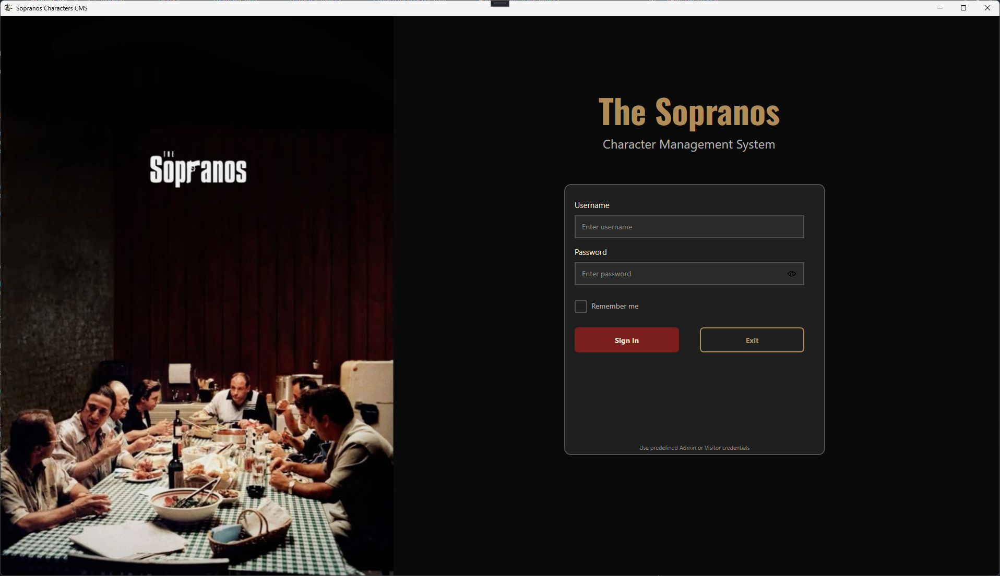
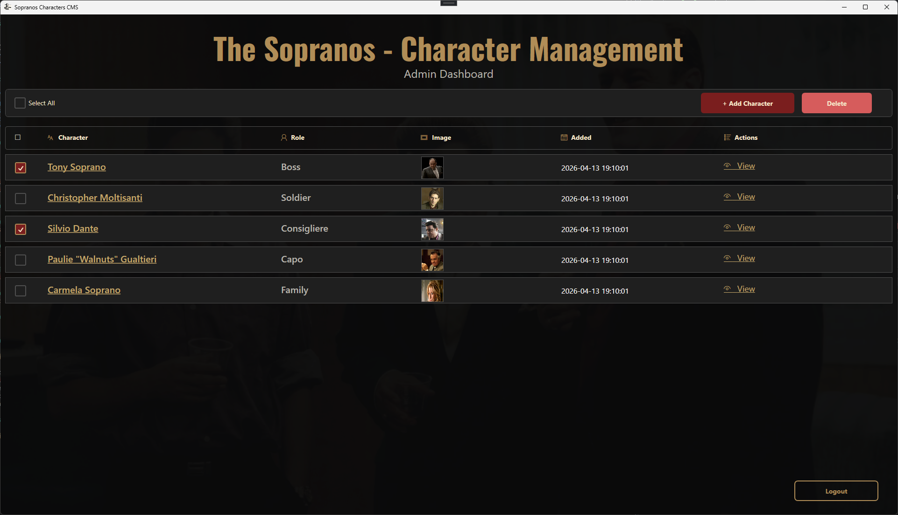
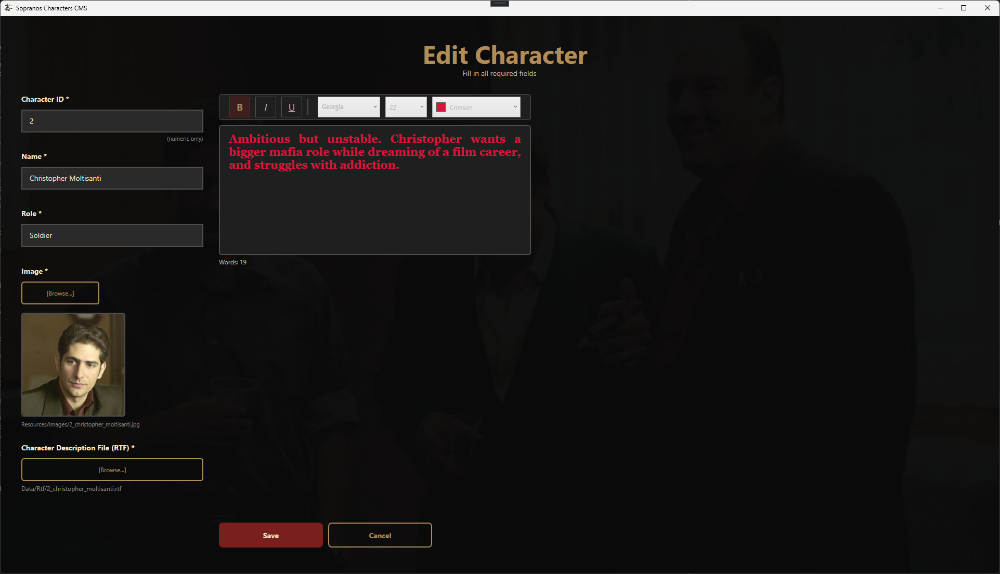
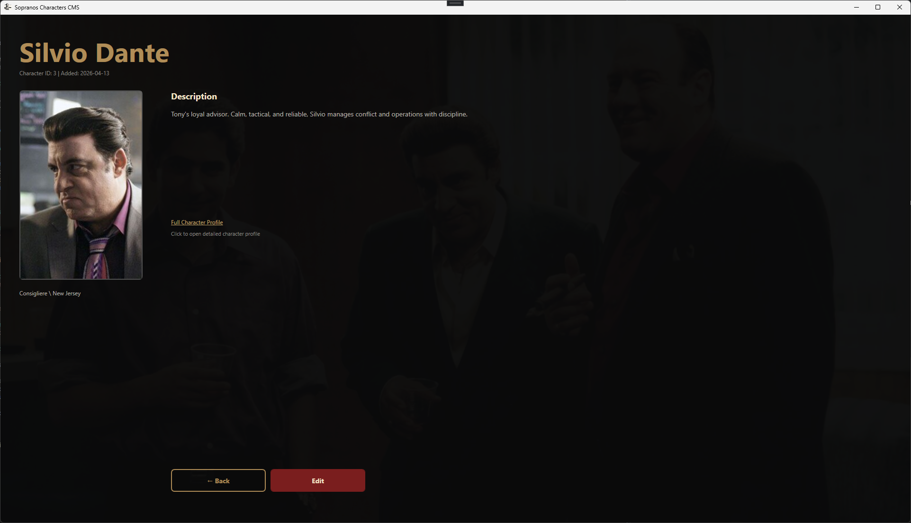
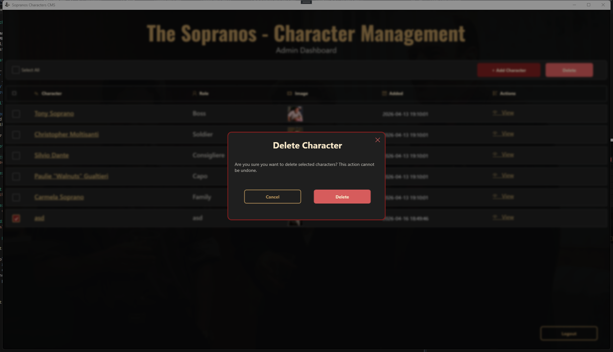
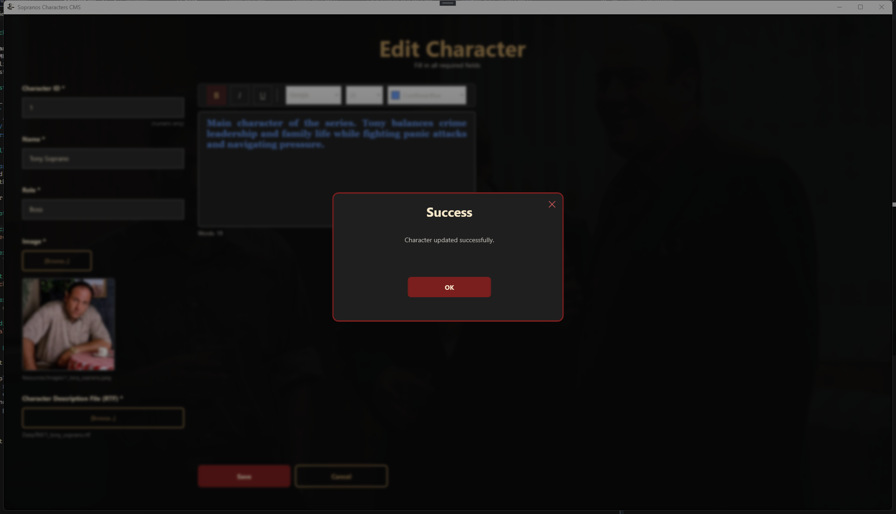
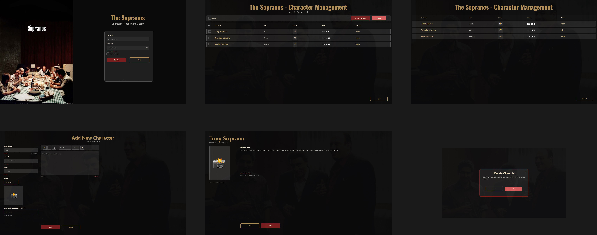

# Sopranos Characters CMS

A desktop CMS app inspired by *The Sopranos*, built in WPF.

I built this project to practice real-world CRUD workflows, role-based access, custom UI design, and file persistence in .NET.

## What this app does

- Login flow with predefined users (`admin/admin`, `user/user`)
- Role-based behavior:
  - **Admin** can add, edit, and delete characters
  - **Visitor** can only view characters and details
- Character management with:
  - Full name and role
  - Rich-text description (RTF)
  - Profile image upload and storage
- Custom themed dialogs for confirmations and notifications
- Consistent dark Sopranos-inspired UI

## Tech stack

- **.NET Framework 4.8**
- **WPF (XAML + C#)**
- XML serialization for users and character metadata
- RTF persistence for formatted descriptions

## Project structure

- `Pages/` - Login, list, details, and add/edit screens
- `Dialogs/` - Custom modal windows
- `Models/` - Domain models and enums
- `Services/` - Data and file persistence logic
- `Converters/` - UI binding converters

## Run locally

1. Open `SopranosCharactersCms.sln` in Visual Studio.
2. Build and run the project.
3. Login with:
   - Admin: `admin / admin`
   - Visitor: `user / user`

## Screenshots

### Login screen

### Character list (admin dashboard)

### Add/Edit character

### Character details view

### Custom dialogs (delete confirmation & success)

### Figma design

## Why this project matters for my portfolio

This project shows that I can:

- Build complete desktop features end-to-end
- Work with role-based UX and navigation
- Implement custom WPF styling beyond default controls
- Persist and manage structured app data
- Debug and polish details for a production-like user experience

## License

This project is licensed under the MIT License. See the `LICENSE` file for details.
